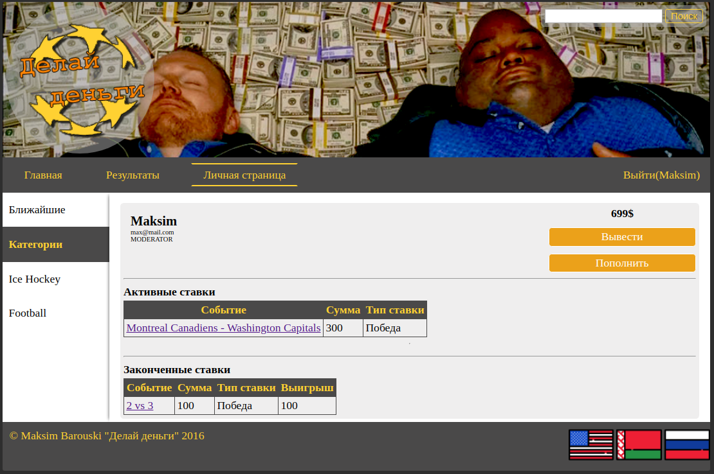

# Java.EE.Totalizator
Web-application on Java EE for making bets on sport events.

## First setup

- `make start_environment`
- `docker exec -it MYSQL_CONTAINER_ID /bin/bash`
- `mysql -p` and use `root` as password
- `CREATE DATABASE totalizator_db_schema;` - not needed if database is created 
- `CREATE USER 'totalizator_user'@'%' IDENTIFIED BY 'totalizator_pass';`
- `grant all on *.* to 'totalizator_user'@'%' IDENTIFIED BY 'totalizator_pass';`

## Second (and others) setup

- `make start_environment`
- `make compile` - unnecessary if you already built the application
- `make run`

## Demo

